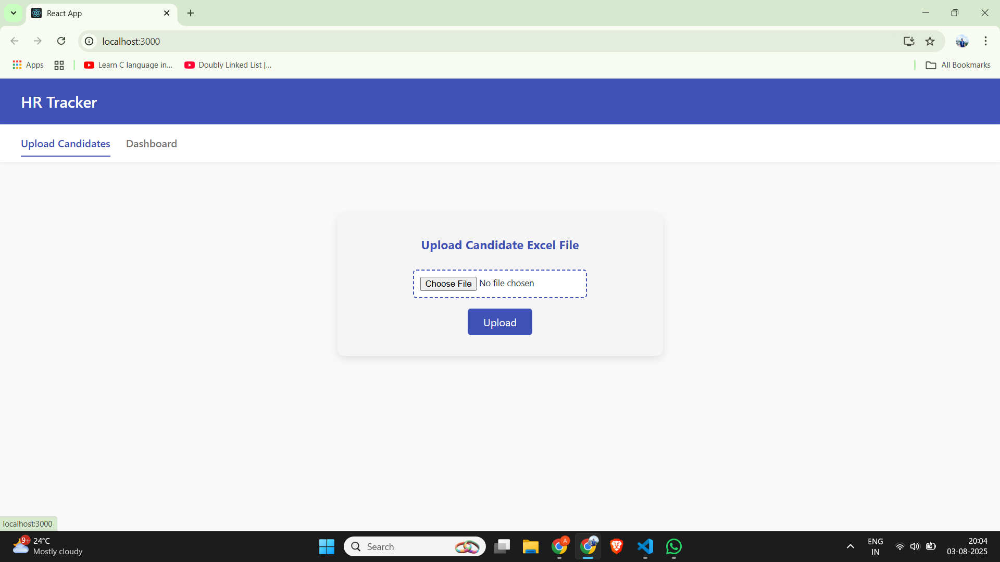
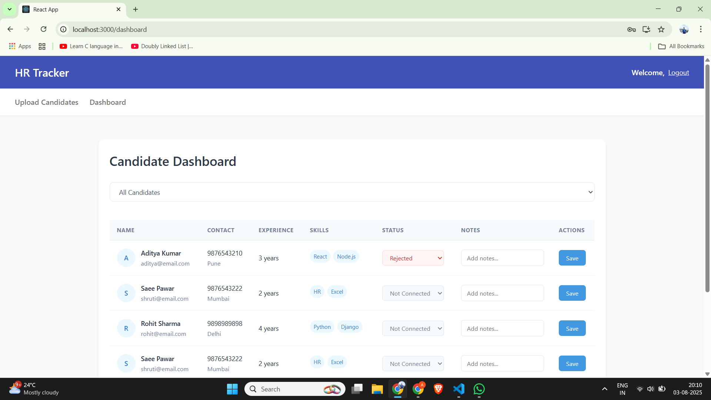

# 💼 Cravita Technologies - MERN Stack Task

This project was completed as a technical task for *Cravita Technologies*. It is a responsive **MERN Stack** application designed to demonstrate CRUD operations with proper UI/UX, API integration, and modular structure.

---

## 🔧 Tech Stack

- **MongoDB** – NoSQL database for storing user data.
- **Express.js** – Web framework for Node.js to handle APIs.
- **React.js** – Frontend library to build responsive UI.
- **Node.js** – Runtime for backend server operations.

---

## 📸 Task Preview:

### ✅ Task Output
||

---
🧩 Features
✅ Clean UI as per Cravita tech. design

✅ Fully responsive design

✅ React Hooks for state management

✅ Modular folder structure

✅ Environment configuration with .env

📬 Contact
Developed with ❤️ by Aditya Bhosale
📧 adityabhosale@email.com

